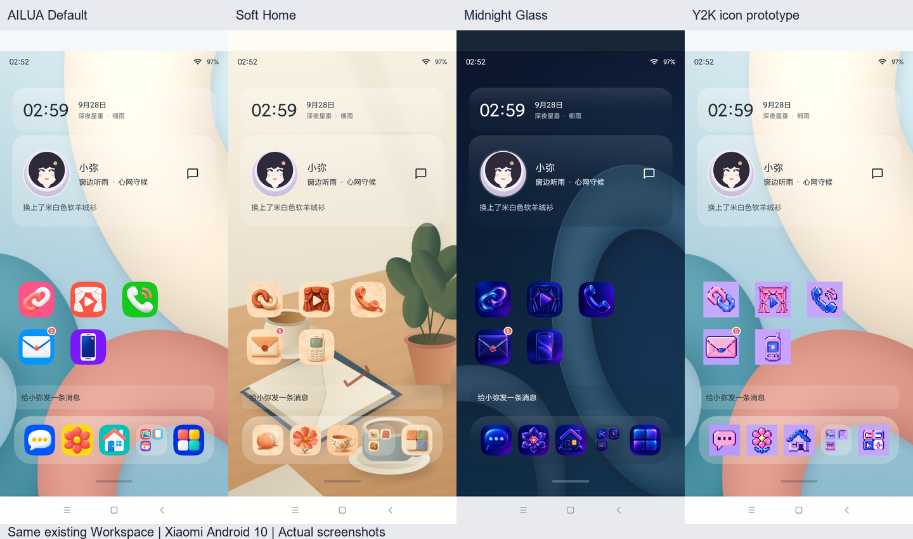
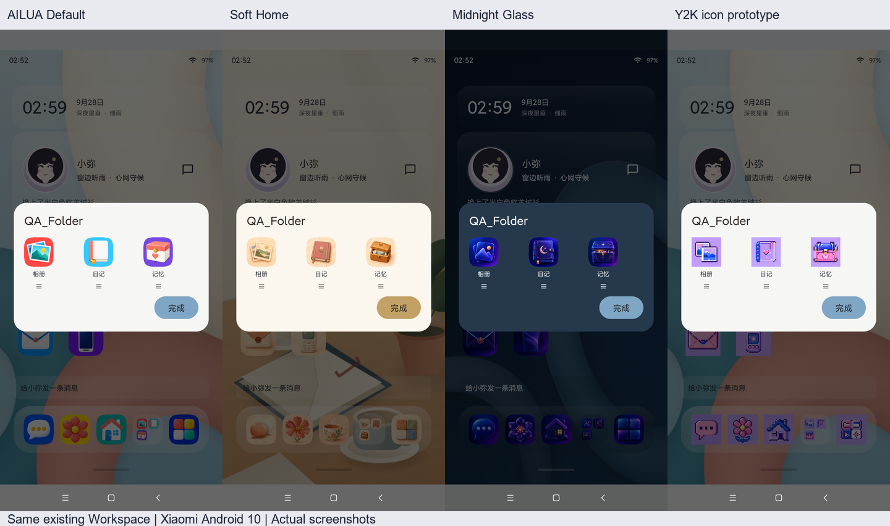
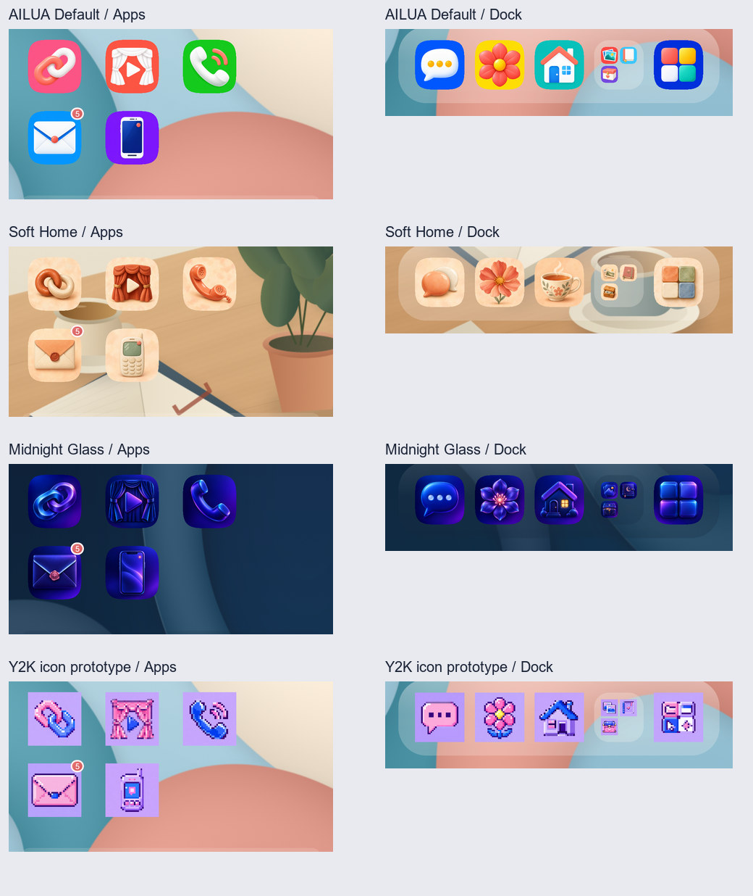

# P5.V UIR-3A → 3D 实施与真机视觉报告

日期：2026-10-04。分支：`local-pass3c-ai-runtime`。冻结基线：`161fa130f683d0c85368971e384583d410731aec`。

## 交付

- Default、Soft Home、Midnight 各 18 个正式图标候选，Y2K 18 个可切换像素图标原型，共 72 个。
- 继续原 `iconStyleId → IconResolver` 链路。优先级为 manual → 外部源 → 当前官方 → Default → vector fallback。
- 修复 bitmap 未裁切导致的方角；前三套为统一 squircle，Y2K 为 square。外部图标保留原形，bitmap 不再套白边或玻璃圈。
- 修复导入预览缺图时丢失官方样式覆盖、混入旧外部图标的问题；fallback 与应用后的选择一致。
- Home、Dock、Folder 缩略图、Folder 展开、AppLibrary 与主题预览复用同一解析链。
- 保留四个 legacy 主题、`DEFAULT_ID=milk`、七栏主题中心，以及用户外部/manual 图标覆盖。
- Launcher 布局、Widget 信息与位置、Workspace/Pager/Drag/Folder/Dock 模型、业务 Runtime、数据库均未改动。

## 真实审美检查

逐套实际打开 18 图大图与 56/44/24px 拼图；并实际打开以下四主题同桌面、Folder、图标区域真机对照图。

| 样式 | 实际视觉结果 |
|---|---|
| Default | 鲜明色块、实体自绘图形，App 与 Dock 有明确身份，圆角统一 |
| Soft Home | 暖色陶瓷、纸张、花、茶杯和木盒，插画语言明显；Folder 中相册/日记/记忆仍可辨 |
| Midnight | 不透明深蓝紫实体，克制青/粉亮边，未恢复透明玻璃圈 |
| Y2K | 32px 像素构图与粉紫蓝，边缘保持方形，在 Default 原壁纸上也可与前三套区分 |

未重排首页。角色仍为设备原有小弥，人物素材仍使用原 fallback。Soft 联系人/齿轮在极小尺寸较低对比，Midnight 记忆箱细节较密；本轮保存为候选，最终审美由用户对照图确认。

## 验证结果

| 检查 | 结果 |
|---|---|
| 最终离线单测 | **605/605 PASS**，0 failure/error/skip，112 suites |
| Debug / androidTest build | **PASS** |
| 设备 | 小米 M2007J22C，Android 10 / API 29，1080×2340 |
| ADB / 覆盖安装 | **PASS**，`install -r`，保留数据 |
| 72 个 Android bitmap | **PASS**，实际解码 64×64，非空，alpha 全 255 |
| 四套生产入口切换与截图 | **PASS**，通过主题中心实际选择，Y2K 作为图标覆盖而非新主题 |
| Folder 缩略图与展开 | **PASS**，四套各保存截图 |
| Workspace / Widget / Dock | **PASS**，3 页、18 item、1 Folder；位置、span、rank、Folder 内容完全一致 |
| 设置恢复及强停冷启动 | **PASS**，原 Milk + cream、图标大小、标签设置、Control Center 设置保持一致 |
| 聊天 / 记忆 / schema | **PASS**，完整行对比一致：6 session / 4 turn / 5 variant / 0 memory；schema 8 |
| 应用 UID logcat | 未见 AILUA FATAL EXCEPTION、主题资源加载或文件权限、ZIP/XML 异常 |

实机测试 `P5VProductionIconsSmokeTest` 最终 `OK (1 test)`，约 29.99 秒。首轮因手机前台处于浏览器/系统通知面板而超时，没有判为通过；显式打开 AILUA 后重试成功。对应初始日志单独保留。

UID 日志包含厂商 `DrmMtkUtil/SecureTimer` 读取 `proc/uptime` 的 `Permission denied`；本轮未观察到它导致 AILUA 图标或主题资源失败。

原始截图保存在 `H:/ailua/dist/qa/P5.V-UIR3/device/`，未美化或修改 UI；对照板仅等比例缩放、裁出实际图标区域，并在截图外添加标签。数据库快照与 UID 日志仅保存在本机被 Git 忽略的 QA 目录。

## 资产来源与复用

使用已获用户确认的 imagegen CLI/API 方式，调用技能 bundled `image_gen.py generate-batch`，用户指定服务与请求模型 `gpt-image-2`；每张独立 Prompt，未下载第三方图标或商业主题。

- 原始 PNG 实际尺寸均为 1254×1254，服务未遵从请求的 1024×1024。
- 72 个规范化资产为 256×256 不透明 RGB lossless WebP，总计 2,951,478 bytes；无裁剪或补边。
- Default / Soft / Midnight 使用等比例 Lanczos；Y2K nearest 到 32px 再 nearest 到 256px。
- 72 条 Prompt：`docs/design/UIR3_ICON_PROMPTS.jsonl`。
- 原图、资源与 Prompt 的 SHA-256、来源、尺寸、审美检查记录：`docs/design/UIR3_ICON_ASSET_MANIFEST.json`。
- 本机原图：`output/imagegen/uir3/raw/`。凭证使用本机用户 DPAPI 加密，仅在生成子进程环境解密，不写明文日志或 Git。
- 技能脚本未修改；本项目脚本只做 Prompt、缺项检查、规范化、拼图和 manifest。

服务商商用条款尚未独立核实，manifest 明确为 `pending-rights-review`；图标当前是视觉候选，不宣称发布权利已验证。

## APK 与停点

APK：`H:/ailua/dist/AILUA-P5.V-UIR3-debug.apk`。

SHA-256：`65e50242ce0388b69201f2ea0feafd57e9a8bf6fe7304876e5ba2bd7f4153701`。

Android 10 使用原 tint + highlight Glass fallback；本轮没有 Android 31+ 真 blur 证据，不能标记 Glass Production Verified。

本轮停在 **UIR-3D 真机视觉评审**。后续 Rainy / Sakura / 完整 Y2K 主题、Theme Center 改版、正式人物 ART 与 P5.6 均待后续指令。
